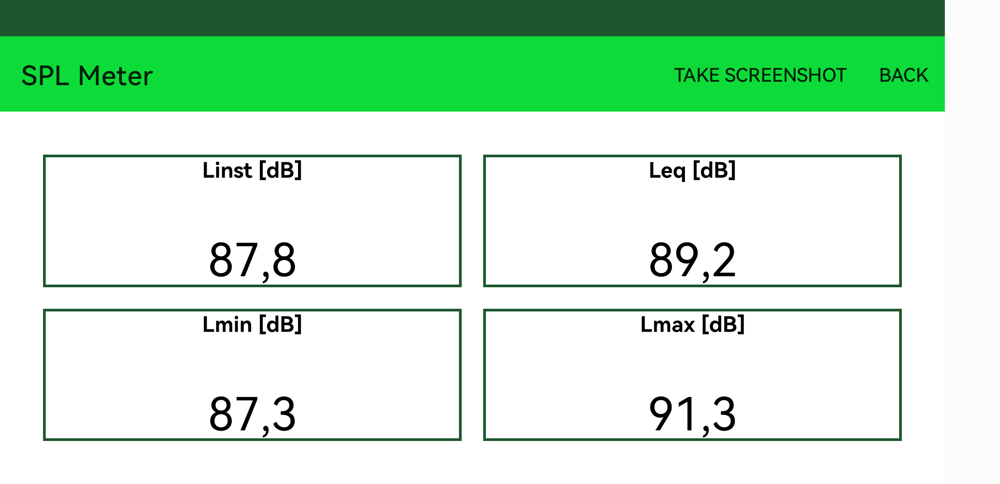
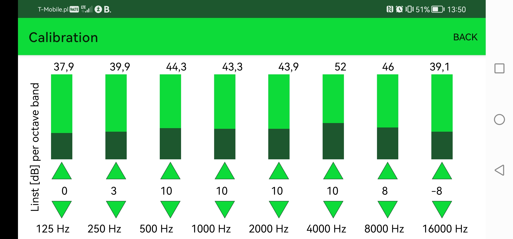
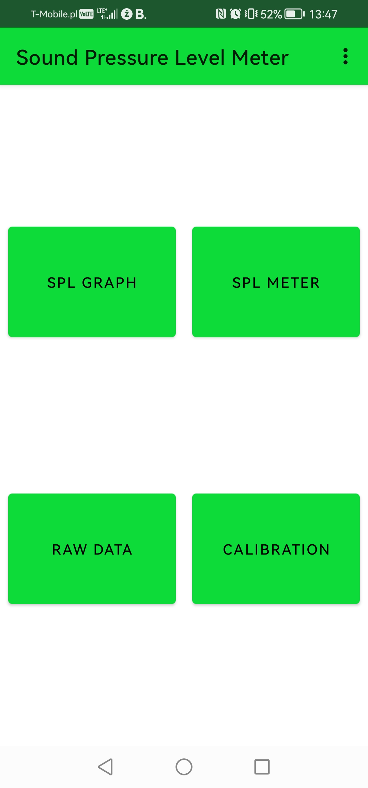
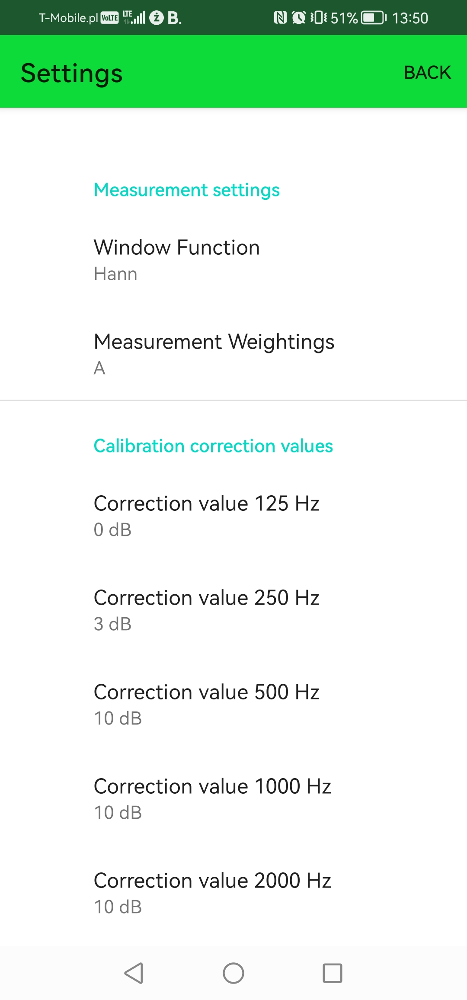
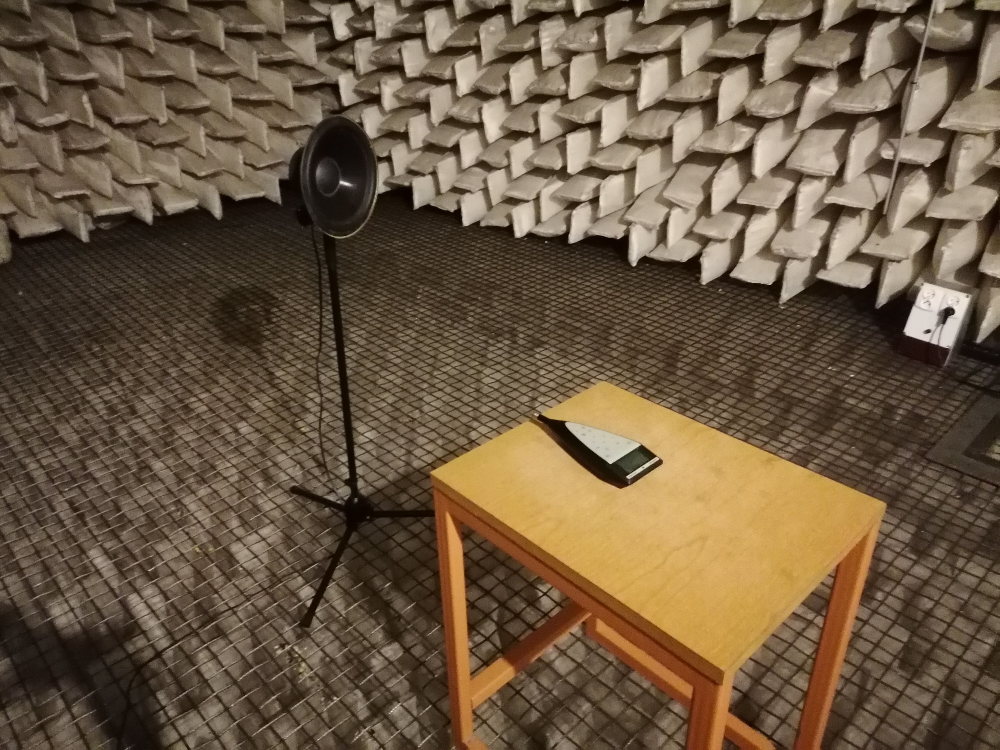
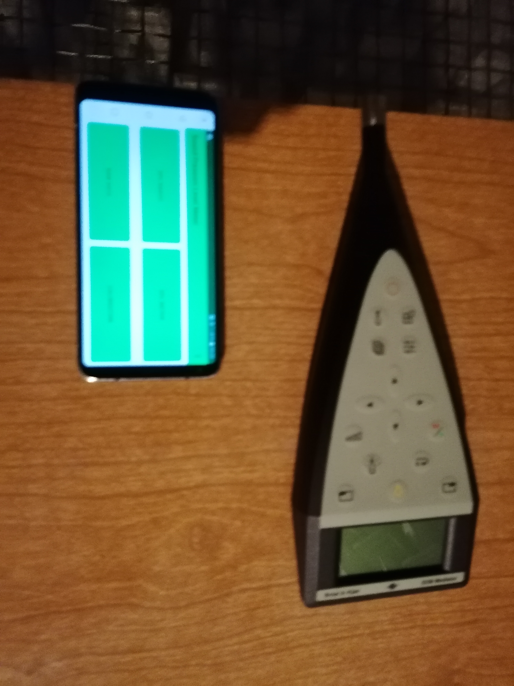

# Sound Pressure Level Meter

A mobile application for Android devices, which allow to perform
sound pressure level measurements using device's internal microphone.
Such solution could potentially aid traditional sound level meters in occupational risk assessment.

The application was nominated to [Ogólnopolska Studencka Konfenerencja Akustyków - Polish Students Acoustic Confenrence](https://oska-konferencja.pl/)

Hereby repository contains an Android Studio project for author's master's thesis:
**Sound level meter – development and comparison
of software and hardware implementation**.

## Table of Contents
* [Abstract](#abstract)
* [Technologies Used](#technologies-used)
* [Features](#features)
* [Screenshots](#screenshots)
* [Setup](#setup)
* [Keywords](#keywords)
* [Authors](#authors)
* [License](#license)

## Abstract

The first goal of this master’s thesis was to develop a *mobile application for
smartphones running the Android operating system*. Said application serves as a *sound
level meter and allows for sound pressure level measurements*, using mobile device’s
internal microphone to capture audio. Software developed by thesis’ author lets users
estimate noise level in a room and perform occupational risk assessment in the process.
The application’s functionality allows for:
1. Measurement of parameters including:
    - Instantaneous sound level *Linst*
    - Equivalent continuous sound level *Leq*
    - Maximum sound level *Lmax*
    - Minimum sound level *Lmin*
2. The choice of a window function applied to the acquired audio signal including:
    - Hanning function
    - Hamming function
    - Flat Top function
3. The choice of a frequency weighting compliant with IEC 61672-1 standard including:
    - A-weighting
    - C-weighting
    - Z-weighting
4. Calibration of a mobile device by using a certified sound level meter
5. Capturing screenshots to store measurement results in smartphone’s memory

The second goal of the thesis is the comparison of measurement results obtained
via both the developed mobile app and a measurement device used as standard. The
device in question is a certified sound level meter that meets **Class 1 requirements of IEC
61672 standard**. The instrument used is also available in **Electroacoustics Division of the
Institute of Radioelectronics and Multimedia Technology**. The conducted measurements
shed favourable light on the usefulness of a software implementation of a sound level
meter as an alternative to widely accepted hardware implementation. Mobile devices that
have the measurement app installed were used for testing. The obtained results suggest
that while the software implementation is not fully compliant with IEC 61672-1 standard,
it allows for an initial estimate of noise level.

## Technologies Used

Languages:
* Java 8+
* Kotlin 1.6.10

Tools and libraries:
* Android Studio [download here](https://developer.android.com/studio)
* Android SDK [API Reference](https://developer.android.com/reference)
* JTransforms library by Piotr Wendykier [GitHub repository](https://github.com/wendykierp/JTransforms)

## Features

* *Real time measurement* of sound pressure level-related parameters via audio signal analysis
* The choice of a *window function* applied to the acquired audio signal
* The choice of a *frequency weighting compliant with IEC 61672-1* applied to the signal
* *Calibration* of a mobile device via a calibration procedure described in master's thesis
* *Capturing screenshots* to store measurement results in smartphone’s memory
* *Audio signal acquistion* which bypasses signal processing introduced by Android system

## Screenshots

Real life measurements and calibration in the anechoic chamber of [Electroacoustic Division](https://www.ire.pw.edu.pl/about-the-institute-2/structure/divisions/)
of **The Institute of Radioelectronics and Multimedia Technology**.

Calibration procedure using **Huawei P30 Lite** and **Brüel & Kjær 2238 Mediator** sound level meter.

## Setup

* Download this repository or clone using `git clone https://github.com/JacobtheRipper/Sound_Pressure_Level_Meter.git`
* Move to the project directory `cd SoundPressureLevelMeter`
* Open the project using Android Studio
* Build and run application as described [here](https://developer.android.com/studio/run)

**NOTE:**
The application has been tested on the following Android Operating Systems:
* Android 8
* Android 9
* Android 10
* Android 11
* Android 12

Which according to [Android API Levels website](https://apilevels.com/)
corresponds to **target SDK levels from 26 to 32**

## Keywords
*Mobile devices*, *Sound level meter*

## Authors
mgr inż. Jakub Turliński

**Promoter**: dr inż. Grzegorz Makarewicz

## License
Master's thesis and the codebase provided by the author belong to **Warsaw University of Technology**.

